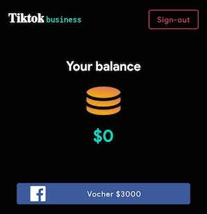
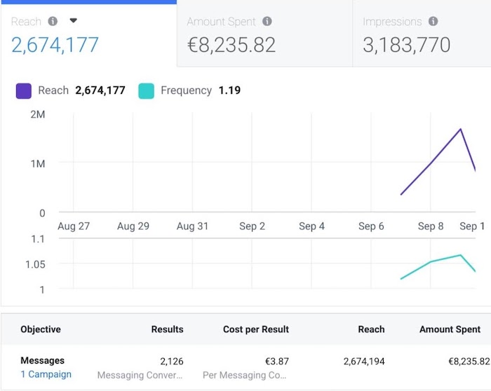
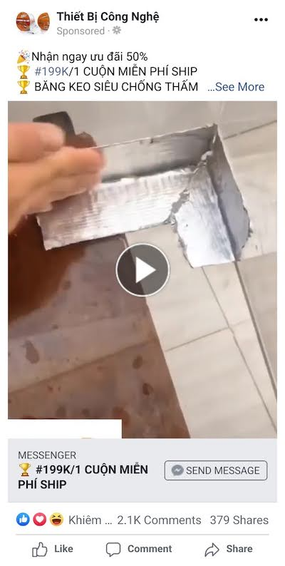

# How I lost €4k in a Facebook scam

**TLDR**: don't click ads if you don't trust them 100%

This is a cautionary tale of how I lost close to €4,000 in a sophisticated Facebook scam. I still find it hard to believe I fell for a scam like this. I have 2FA on all my accounts, use a password manager, and I'm generally very cautious with account security.

Two days ago, I spotted an ad while browsing Facebook promoted by [Tiktok Ads Business](https://www.facebook.com/Tiktok-Ads-Business-101239798393070/). Unfortunately I don't have a screenshot of the ad in question, but it promised a $3000 credit for new businesses that signed up for the TikTok Ads program. As someone being 15+ years in ad tech, I am used to the idea of businesses giving away ad credits to new advertisers. $3000 is a very high amount, but it didn't raise any red flags since I've heard of the generous [TikTok Back to Business Program](https://www.tiktok.com/business/en/back-to-business-program) before.

The ad click took me to the [TikTok Ads Business](https://play.google.com/store/apps/details?id=com.acazira.tforbusiness) Android app on the Google Play Store. 10k+ downloads, 1000+ reviews and a 4.6 rating on average - again, this didn't raise any immediate red flags. Sure, the developer name "Develop App" sounds strange and should I have looked better, the developgameonline@gmail.com developer email and com.acazira.tforbusiness package name would have definitely raised some concerns.

After installing the app, it opened a clone of the [TikTok Back to Business Program](https://www.tiktok.com/business/en/back-to-business-program) page. After entering my phone number and email, the app asked me to log in with Facebook to get the credits.

After logging in with my Facebook, a voucher code was displayed under the balance with the explanation that it would take up to 48 hours before TikTok would contact me:

Two days went by and I was getting curious when I would get that promised email. Then, a transaction email from PayPal arrived:

Facebook charged €3,990.17 from my linked business PayPal account. I was surprised - I didn't recognize the ad spend so I tried to log in to my Facebook Ad account. Unfortunately it was nowhere to be found - the scammer used my Facebook auth token to remove me from the Facebook Business entity. Strangely enough this is possible without getting any emails from Facebook. I had no way to check my Business entity or Ad account on Facebook to see what's going on.

Contacting Facebook about such scams/hacks is a challenge on its own: there is a [support page](https://www.facebook.com/business/help/support) but in all my attempts I was unable to click the "email" icon. The "chat" icon always says "chat unavailable":

Fortunately I found the [Facebook Business Support](https://www.messenger.com/t/facebookadsupport) messenger account, and they replied quickly by confirming the issue:

A day later I contacted Facebook for an update, and they confirmed the issue again. Another 24 hours later an I got full access back to my ad account. This is the damage that was done before Facebook disabled the account:

All this money was spent on this one Vietnamese ad, promoting some kind of aluminium 🤔 product:

To recap:
* Total spent: €8,235.82 (of which I was charged €3,990.17)
* Total impressions: 3,184,933
* Total reach: 2,674,194
* Total conversions: 2,126 "send message" clicks 😳

I am still waiting on a decision from Facebook if they are going to refund the charge. In the meantime, I have done the following:
* Changed my Facebook and PayPal passwords
* Invalidated all signed in devices/tokens
* Reported the fake TikTok Ads Business page to Facebook - no reponse yet
* Reported the fake TikTok Ads Business app to Google - the app was taken down 2 days later
* Initiated a PayPal chargeback process - PayPal responded: "we’ve determined there was **no** unauthorized use"